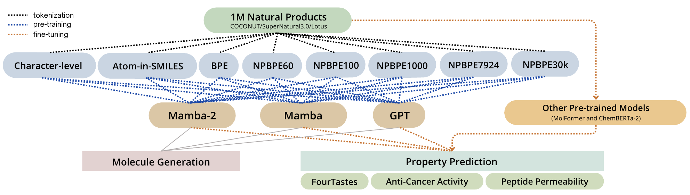
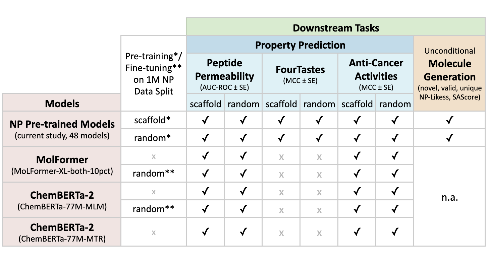

# 🧪 CLMs for Natural Products

This repository accompanies the thesis *“Chemical Language Models for Natural Products: A Comparative Study of Mamba and GPT on Molecule Generation and Property Prediction.”*

It includes all major components for pre-training and evaluating Chemical Language Models (CLMs) on Natural Product (NP) SMILES data (excluding the Tox21 downstream task).

## ✅ What's Included

- **Data** includes the pre-training data of over 1 million NPs and 4 downstream property prediction datasets 
- **Tokenizer implementation and vocab.json files** for Character-level, Atom-in-SMILES (AIS), BPE (from DeepChem), and five NPBPE tokenizers of different vocabulary sizes    
- **Pre-training code** for 48 CLMs (3 model types (GPT, Mamba, Mamba-2) × 8 tokenizers × 2 data splits (scaffold and random splits)) on the curated 1M NP dataset  
- **Hyperparameter search code** to optimize the 48 model-tokenizer pair configurations   
- **Fine-tuning code** for NP-relevant property prediction tasks (excluding Tox21):  
  - Peptide membrane permeability  
  - Taste classification  
  - Anti-cancer activity prediction  
- **Fine-tuning scripts for benchmark models**: MolFormer and ChemBERTa-2 (MLM and MTR versions)
- **Molecule generation script** using autoregressive sampling 
- **Generated pseudo-NP molecules** using each of the 48 models 
- **A dockerfile** is provided to set up the environment to run all experiments
- **Experiment launcher script**: A main shell script (`run_experiments.sh`) is provided to run all major experiments

> ⚠️ **Model Access**  
A Hugging Face model access key is temporarily provided for repository and code evaluation. The models will be made publicly available later on. Please do not misuse this access.

> ⚙️ **Environment Setup and Running Instructions**  
Setup and running instructions provided are specificly for the LSV cluster. Alternative environments will be explored according to future demand.

> 🔑 **WandB API Key**  
A Weights & Biases (wandb) API key is required for some tasks such as pretraining. It must be passed to the job script as a command-line argument via the HTCondor submit file.  
To do this, set the `arguments` field in your submit file like this: `arguments = YOUR_WANDB_KEY`

> 📁 **Example Usage**  
The `run_experiments.sh` script provides examples for running all major tasks (molecule generation, hyperparameter search, pretraining, and fine-tuning). Uncomment the relevant blocks to execute.

All tasks are orchestrated via `main.py` and can be launched with minimal configuration using  `run_experiments.sh`.

## 🖼️ Workflow & Downstream Application Overview 





## 🗂️ Directory Structure

```
main.py                    # Entry point
mol_generation.py          # NP molecule generation 
hpsearch.py                # Model pre-training hyperparameter search  
pretraining.py             # Model pre-training for Mamba, Mamba2, and GPT
finetuning.py              # Fine-tuning on property prediction tasks
sam.py                     # SAM implementation from UU-Mamba (arXiv:2402.03394)
tokenisers.py              # Custom tokenizers implementation 
data/                      # Contains pre-training 1M NPs and downstream task data files
├── 1M_NPs/                # Random and Scaffold Split 1M NPs pre-training data
└── downstream_task_ata/   # Random and Scaffold Split 5x5 CV Downstream Task Datasets
molformer_n_chemberta_2/   # Contains MolFormer and ChemBERTa-2 fine-tuning code 
vocab_files/               # Contains vocab.json files for all custom tokenizers 
lsv_cluster_files/         # Contains cluster-related setup
├── mamba.dockerfile       # Dockerfile for Mamba training environment
├── run_experiments.sh     # Shell script to run experiments using main.py 
└── run_experiments.sub    # Cluster job submission script
```


## 📦 Environment Setup

### 🔧 Docker Image

Run the following commands to build the docker image. 

`docker build --no-cache -f ./lsv_cluster_files/mamba.dockerfile --build-arg USER_UID=$UID --build-arg USER_NAME=$(id -un) -t docker.lsv.uni-saarland.de/[lsv_user_name]/[image_name]:[tag_name] .`

`docker push   docker.lsv.uni-saarland.de/[lsv_user_name]/[image_name]:[tag_name]`


## ⚙️ How to Run Tasks

After cloning this repository into your cluster workspace, all tasks can be executed via `main.py` using the `run_experiments.sh` bash file. It is provided as an example of how to run all tasks specified above, and the details on how to set task-specific configurations are described below. Uncomment the block corresponding to the task you want to run in `run_experiments.sh`.

> **Note**: The path `/nethome/[lsv_user_name]/CLMs-for-NPs/main.py` assumes you have cloned the repo into `/nethome/[your_username]/`. Replace `[lsv_user_name]` with your actual username. If you placed it somewhere else, adjust the path accordingly. 

### 1. Molecule Generation

Molecule generation logic loads a pretrained GPT or Mamba model and its corresponding tokenizer to generate pseudo-NP SMILES strings using autoregressive sampling. It infers configuration details from the model name, generate the sequence,  computes token-sum log-likelihood for each sequence, and writes the results to a CSV file.

Configuration Options:
- task: "generate"
- num_mols: default=32 (set the number of molecules you want to generate)
- temperature: default=1.0 (control sampling randomness (lower = more deterministic, higher = more random), 1.0 means no adjustment to the model’s predicted probabilities)
- max_length: default=512 (set the max length of the generated molecules)
- model_names: model names follow the format rozariwang/[MODEL]-[TOKENIZER]-[SPLIT], where:
  - **[MODEL]**: `GPT`, `M1`, or `M2`
  - **[TOKENIZER]**: `Char`, `AIS`, `BPE`, `npbpe60`, `npbpe100`, `npbpe1000`, `npbpe7924`, or `npbpe30k`
  - **[SPLIT]**: `rds` (random split) or `sfs` (scaffold split)

```bash
python3 /nethome/[lsv_user_name]/CLMs-for-NPs/main.py \
  --task generate \
  --num_mols 1000 \
  --temperature 1 \
  --max_length 512 \
  --model_names rozariwang/M2-NPBPE1000-rds
```

---

### 2. Hyperparameter Search

Hyperparameter (random) search over half of the entire search space for GPT and Mamba-based models, determining the best hyperparameter set for pre-training different model-tokenizer combinations. It trains each model over 5 epochs per configuration, and selects the best hyperparameters based on the lowest validation loss in the last epoch.

Configuration Options:
- task: "hpsearch"
- hp_model: "GPT", "Mamba1", or "Mamba2"
- hp_tokenizer: "Char", "AIS", "BPE", "NPBPE60", "NPBPE100", "NPBPE1000", "NPBPE7924", or "NPBPE30k"
- hp_split: "random" or "scaffold"

```bash
python3 /nethome/[lsv_user_name]/CLMs-for-NPs/main.py \
  --task hpsearch \
  --hp_model GPT \
  --hp_tokenizer AIS \
  --hp_split random
```

---

### 3. Pretraining (requires WandB key)

Pre-training 48 model variations on 1M NPs: 
3 model types (GPT, Mamba, or Mamba2) * 8 tokenizers (Char, BPE, AIS, NPBPE60, 
NPBPE100, NPBPE1000, NPBPE7924, NPBPE30k) * 2 data split methods (random, scaffold)

Configuration Options:
- task: "pretrain"
- wandb_key: set it the `arguments` field in your submit file
- pt_model: "GPT", "Mamba1", or "Mamba2"
- pt_tokenizer: "Char", "AIS", "BPE", "NPBPE60", "NPBPE100", "NPBPE1000", "NPBPE7924", or "NPBPE30k"
- pt_split: "random" or "scaffold"
- pt_n_embd: default=256 (set from hyperparameter search result)
- pt_n_layer: default=8 (set from hyperparameter search result)
- pt_lr: default=1e-4 (set from hyperparameter search result)
- pt_n_head: default=None  (set from hyperparameter search result, only needed for transformer models)

```bash
python3 /nethome/[lsv_user_name]/CLMs-for-NPs/main.py \
  --task pretrain \
  --wandb_key "$1" \
  --pt_model GPT \
  --pt_tokenizer NPBPE1000 \
  --pt_split random \
  --pt_n_embd 256 \
  --pt_n_layer 8 \
  --pt_lr 1e-4 \
  --pt_n_head 4
```

Use `--pt_n_head None` for non-GPT models.

---

### 4. Fine-tuning

Fine-tuning and evaluation for 3 downstream classification tasks using 48 NP 
pretrained models (3 model types (GPT, Mamba, or Mamba2) * 8 tokenizers * 2 data split methods)

Configuration Options:
- task: "finetune"
- sub_task: "anti_cancer", "peptides", or "tastes"
- model_split: "sfs" or "rds"  (how the pre-training 1M NPs data is split)
- data_split: "sf" or "rd"

```bash
python3 /nethome/[lsv_user_name]/CLMs-for-NPs/main.py \
  --task finetune \
  --sub_task peptides \
  --model_split sfs \
  --data_split sf
```

---

### 5. Fine-tuning ChemBERTa-2

Fine-tuning ChemBERTa-2 MLM on 1M NPs
```bash
python3 /nethome/[lsv_user_name]/CLMs-for-NPs/ChemBERTa2_MLM_Finetune_on_1M_NPs.py 
```

Fine-tuning ChemBERTa-2 on property prediction tasks \
Configuration Options:
- task: "chemberta"
- chemberta_model_type: "mlm" (original model), "mtr" (original model), or "mlm-finetuned" (fine-tuned on 1M NPs) 
- sub_task: "anti_cancer" or "peptides"
- data_split: "rd" or "sf"
```bash
python3 /nethome/[lsv_user_name]/CLMs-for-NPs/main.py \
  --task chemberta \
  --chemberta_model_type mtr \
  --sub_task anti_cancer \
  --data_split sf
```

### 6. Fine-tuning MolFormer

Fine-tuning MolFormer on 1M NPs (requires WandB key)
```bash
python3 /nethome/[lsv_user_name]/CLMs-for-NPs/main.py \
  --task molformer_1M_NPs \
  --wandb_key "$1"
```

Fine-tuning MolFormer on property prediction tasks \
Configuration Options:
- task: "molformer" (original model) or "molformer-finetuned" (fine-tuned on 1M NPs)
- molformer_variant: "molformer" or "molformer-finetuned"
- sub_task: "anti_cancer" or "peptides"
- data_split: "rd" or "sf"
```bash
python3 /nethome/[lsv_user_name]/CLMs-for-NPs/main.py \
  --task molformer \
  --molformer_variant molformer \
  --sub_task peptides \
  --data_split rd
```
